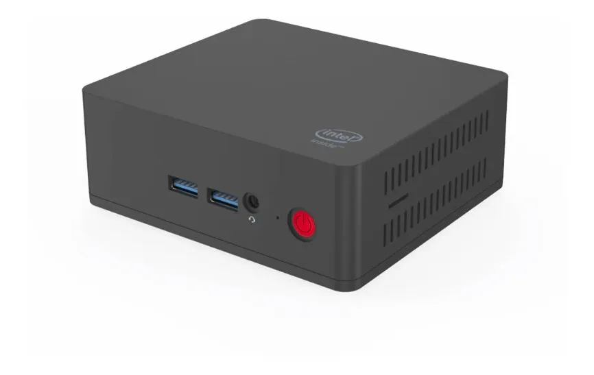

<h1 align="center">
  
   
  Smart Home
</h1>
<h4 align="center">Marque :star: no meu repositório de configuração para que você possa se manter atualizado sobre qualquer progresso diário!</h4>

  <h4>
    
    
    
    
  </h4>

## Dispositivos

<table align="center" border="0">
  <tr>
    <th>Imagem</th>
    <th>Nome</th>
    <th>Descrição</th>
    <th>Quantidade</th>
    <th>Conexão</th>
  </tr>

  <tr>
    <td>
      
    </td>
    <td>Intel Nuc Celeron</td>
    <td>Central de automação do HomeAssistant. Nuc Intel Celeron 2,50 Ghz, 4ram, Hd 64gb, Ubuntu Server</td>
    <td>1</td>
    <td>Wifi, cloud, local</td>
  </tr>

  <tr>
    <td>
      
    </td>
    <td><a target="_blank" href="https://slae.sh/projects/cc2652/">Slaesh's CC2652RB stick</a></td>
    <td>Hub Zigbee com zigbee2mqtt</td>
    <td>1</td>
    <td>Zigbee, local</td>
  </tr>

  <tr>
    <td>
      
    </td>
    <td>TP-Link Deco M5</td>
    <td>Roteador Wifi Mesh</td>
    <td>1</td>
    <td>cloud, wifi, local</td>
  </tr>

  <tr>
    <td>
      
    </td>
    <td>Amazon Echo Dot 3</td>
    <td>Noticações sonoras, comando por voz, musica</td>
    <td>5</td>
    <td>Wifi, cloud</td>
  </tr>
  <tr>
    <td>
      
    </td>
    <td>Amazon Echo</td>
    <td>Noticações sonoras, comando por voz, musica</td>
    <td>1</td>
    <td>Wifi, cloud</td>
  </tr>
  <tr>
    <td>
      
    </td>
    <td>Amazon Echo Echo 8</td>
    <td>Noticações sonoras, comando por voz, musica</td>
    <td>1</td>
    <td>Wifi, cloud</td>
  </tr>
  <tr>
    <td>
      
    </td>
    <td>Google Home Mini</td>
    <td>Noticações sonoras, comando por voz, musica</td>
    <td>1</td>
    <td>Wifi, cloud, local</td>
  </tr>
  <tr>
    <td>
      
    </td>
    <td>Google Chromecast</td>
    <td>Stream video, Noticações</td>
    <td>2</td>
    <td>Wifi, cloud, local</td>
  </tr>
  <tr>
    <td>
      
    </td>
    <td>Google Home View</td>
    <td>Stream video, Noticações sonoras, comando de voz</td>
    <td>1</td>
    <td>Wifi, cloud, local</td>
  </tr>

  <tr>
    <td colspan="5" align="center">
      Zigbee
    </td>
  </tr>

  <tr>
    <td>
      
    </td>
    <td><a target="_blank" href="https://www.zigbee2mqtt.io/devices/73693.html">Sylvania LIGHTIFY LED RGBW A19</a></td>
    <td>Iluminação</td>
    <td>20</td>
    <td>Zigbee, local</td>
  </tr>

  <tr>
    <td>
      
    </td>
    <td><a target="_blank" href="https://www.zigbee2mqtt.io/devices/GL-C-007-2ID.html">Gledopto Zigbee LED Controller RGBW (2 ID)</a></td>
    <td>Iluminação</td>
    <td>2</td>
    <td>Zigbee, local</td>
  </tr>

  <tr>
    <td>
      
    </td>
    <td><a target="_blank" href="https://www.zigbee2mqtt.io/devices/GL-S-003Z.html">Gledopto Zigbee 5W GU10 Bulb RGBW</a></td>
    <td>Iluminação</td>
    <td>1</td>
    <td>Zigbee, local</td>
  </tr>

  <tr>
    <td>
      
    </td>
    <td><a target="_blank" href="https://www.zigbee2mqtt.io/devices/GL-B-001Z.html">Gledopto Zigbee 4W E12/E14 Bulb RGB+CCT</a></td>
    <td>Iluminação</td>
    <td>1</td>
    <td>Zigbee, local</td>
  </tr>

  <tr>
    <td>
      
    </td>
    <td><a target="_blank" href="https://www.zigbee2mqtt.io/devices/GL-D-003P.html">Gledopto Zigbee 6W Downlight RGB+CCT</a></td>
    <td>Iluminação</td>
    <td>1</td>
    <td>Zigbee, local</td>
  </tr>

  <tr>
    <td>
      
    </td>
    <td><a target="_blank" href="https://www.zigbee2mqtt.io/devices/GL-D-004Z.html">Gledopto Zigbee 9W Downlight RGB+CCT</a></td>
    <td>Iluminação</td>
    <td>1</td>
    <td>Zigbee, local</td>
  </tr>

  <tr>
    <td>
      
    </td>
    <td><a target="_blank" href="https://www.zigbee2mqtt.io/devices/GL-D-005Z.html">Gledopto Zigbee 12W Downlight RGB+CCT</a></td>
    <td>Iluminação</td>
    <td>1</td>
    <td>Zigbee, local</td>
  </tr>

  <tr>
    <td>
      
    </td>
    <td><a target="_blank" href="https://www.zigbee2mqtt.io/devices/HGZB-043.html">Zemismart Smart light switch - 3 gang</a></td>
    <td>Interrutor</td>
    <td>10</td>
    <td>Zigbee, local</td>
  </tr>

  <tr>
    <td>
      
    </td>
    <td><a target="_blank" href="https://www.zigbee2mqtt.io/devices/HGZB-043.html">Zemismart Smart light switch - 3 gang sem neutro</a></td>
    <td>Interrutor</td>
    <td>1</td>
    <td>Zigbee, local</td>
  </tr>

  <tr>
    <td>
      
    </td>
    <td><a target="_blank" href="https://www.zigbee2mqtt.io/devices/HGZB-043.html">Zemismart Smart light switch - 3 gang com neutro</a></td>
    <td>Interrutor</td>
    <td>1</td>
    <td>Zigbee, local</td>
  </tr>

  <tr>
    <td>
      
    </td>
    <td><a target="_blank" href="https://www.zigbee2mqtt.io/devices/ZBMINI.html">Zigbee two way smart switch
</a></td>
    <td>Interrutor, switch, relay</td>
    <td>10</td>
    <td>Zigbee, local</td>
  </tr>

  <tr>
    <td>
      
    </td>
    <td><a target="_blank" href="https://www.zigbee2mqtt.io/devices/BASICZBR3.html">Zigbee smart switch</a></td>
    <td>Interrutor, switch, relay</td>
    <td>2</td>
    <td>Zigbee, local</td>
  </tr>

  <tr>
    <td>
      
    </td>
    <td><a target="_blank" href="https://www.zigbee2mqtt.io/devices/WSDCGQ11LM.html">Aqara temperature, humidity and pressure sensor
</a></td>
    <td>Sensor de temperatura, pressão e humidade</td>
    <td>5</td>
    <td>Zigbee, local</td>
  </tr>

  <tr>
    <td>
      
    </td>
    <td><a target="_blank" href="https://www.zigbee2mqtt.io/devices/RTCGQ11LM.html">Aqara human body movement and illuminance sensor</a></td>
    <td>Sensor de iluminação e presença</td>
    <td>5</td>
    <td>Zigbee, local</td>
  </tr>

  <tr>
    <td>
      
    </td>
    <td><a target="_blank" href="https://www.zigbee2mqtt.io/devices/MCCGQ11LM.html">Aqara door & window contact sensor
</a></td>
    <td>Sensor de contato (portas e janelas)</td>
    <td>6</td>
    <td>Zigbee, local</td>
  </tr>

  <tr>
    <td>
      
    </td>
    <td><a target="_blank" href="https://www.zigbee2mqtt.io/devices/SJCGQ11LM.html">Aqara water leak sensor
</a></td>
    <td>Sensor de vazamento de agua</td>
    <td>1</td>
    <td>Zigbee, local</td>
  </tr>

  <tr>
    <td>
      
    </td>
    <td><a target="_blank" href="https://www.zigbee2mqtt.io/devices/MFKZQ01LM.html">Mi/Aqara smart home cubo</a></td>
    <td>Interruptor por gesto (brinquedo kkk)</td>
    <td>1</td>
    <td>Zigbee, local</td>
  </tr>

  <tr>
    <td>
      
    </td>
    <td><a target="_blank" href="https://www.zigbee2mqtt.io/devices/ZNCZ02LM.html">Mi power plug ZigBee</a></td>
    <td>Tomada com medidor de energia</td>
    <td>1</td>
    <td>Zigbee, local</td>
  </tr>

  <tr>
    <td>
      
    </td>
    <td><a target="_blank" href="https://www.zigbee2mqtt.io/devices/DJT11LM.html">Aqara vibration sensor</a></td>
    <td>Sensor de vibração</td>
    <td>1</td>
    <td>Zigbee, local</td>
  </tr>

  <tr>
    <td>
      
    </td>
    <td><a target="_blank" href="https://www.zigbee2mqtt.io/devices/GZCGQ01LM.html">MiJia light intensity sensor</a></td>
    <td>Sensor de iluminação</td>
    <td>1</td>
    <td>Zigbee, local</td>
  </tr>

  <tr>
    <td>
      
    </td>
    <td><a target="_blank" href="https://www.zigbee2mqtt.io/devices/IM6001-MPP01.html">SmartThings Multipurpose sensor (2018 model)</a></td>
    <td>Sensor de temperatura e abertura</td>
    <td>5</td>
    <td>Zigbee, local</td>
  </tr>

  <tr>
    <td>
      
    </td>
    <td><a target="_blank" href="https://www.zigbee2mqtt.io/devices/IM6001-MTP01.html">SmartThings Motion sensor (2018 model)
</a></td>
    <td>Sensor de temperatura e presença</td>
    <td>6</td>
    <td>Zigbee, local</td>
  </tr>

  <tr>
    <td>
      
    </td>
    <td><a target="_blank" href="https://www.zigbee2mqtt.io/devices/TS0044.html">Tuya Wireless switch with 4 buttons
</a></td>
    <td>Botão de cena para até 12 combinações</td>
    <td>2</td>
    <td>Zigbee, local</td>
  </tr>

  <tr>
    <td>
      
    </td>
    <td><a target="_blank" href="https://www.zigbee2mqtt.io/devices/TS0601_switch_4_gang.html">Tuya 4 gang switch
</a></td>
    <td>Interruptor</td>
    <td>2</td>
    <td>Zigbee, local</td>
  </tr>

  <tr>
    <td>
      
    </td>
    <td><a target="_blank" href="https://www.zigbee2mqtt.io/devices/TS0121_plug.html">Zemismart 10A smart plug
</a></td>
    <td>Tomada</td>
    <td>1</td>
    <td>Zigbee, local</td>
  </tr>

  <tr>
    <td>
      
    </td>
    <td><a target="_blank" href="https://www.zigbee2mqtt.io/devices/ZK-EU-2U.html">Zemismart Zigbee 3.0 dual USB wireless socket plug
</a></td>
    <td>Tomada</td>
    <td>4</td>
    <td>Zigbee, local</td>
  </tr>

  <tr>
    <td>
      
    </td>
    <td>Sonoff T2 Switch 3 gang</td>
    <td>Interruptor</td>
    <td>3</td>
    <td>Wifi, local, ESPHome</td>
  </tr>

  <tr>
    <td colspan="5" align="center">
      DIY
    </td>
  </tr>

  <tr>
    <td>
      
    </td>
    <td>Sonoff Pow R2</td>
    <td>Maquina de lavar roupa, bomba piscina, impressora 3d</td>
    <td>3</td>
    <td>Wifi, local, ESPHome</td>
  </tr>

  <tr>
    <td>
      
    </td>
    <td>NodeMCU V3</td>
    <td>Sendor de chuva e presença na cama</td>
    <td>2</td>
    <td>Wifi, local, ESPHome</td>
  </tr>
</table>

## Controle usado na automação

<table align="center" border="0">
<tr>
  <td>Entidade</td>
  <td>Nome</td>
  <td>Descrição</td>
</tr>
  <tr>
    <td>
    guest_mode
    </td>
    <td>
    Tem visita?
    </td>
    <td>
    Usado definir se tem visitas em casa, isso é util para habilitar/desabilitar automações. Por exemplo, quando todos estão na cama uma automação que desliga todas a luzes, porém não existe sensor na camada de visitas. Nesse caso não posso executar essa automação da mesma forma. Outro exemplo é habilitar automaticamente a rede wifi de visitante.
    </td>
  </tr>

  <tr>
    <td>
    sleep_mode
    </td>
    <td>
    Todos estão na cama
    </td>
    <td>
    Usado para identificar se todos estão na cama. Exemplo, tenho gatos em casa, e se todos estão na cama os sensores de presença devem ficar desligados. Outro exemplo, posso ligar o alarme de todos já estão na cama.
    </td>
  </tr>

  <tr>
    <td>
    away_mode
    </td>
    <td>
    Se a casa não tem ninguém
    </td>
    <td>
    Usado para sinalizar que não há ninguém em casa. Por exemplo, se marcado como true desativar sensores de movimento para acender luz ou mesmo desligar todas as luzes.
    </td>
  </tr>

  <tr>
    <td>
    speech_notifications
    </td>
    <td>
    Ativa/Desativa notificações sonoras
    </td>
    <td>
    Tenho diversas automações que emitem frase na Alexa com informações por audio. Porém se esse campo estiver desmarcado, as notificações são suspensas. Util por exemplo para desligar quando todos estiverem na cama ou mesmo fora de casa.
    </td>
  </tr>

  <tr>
    <td>
    text_notifications
    </td>
    <td>
    Ativa/Desativa notificações por texto no Telegram
    </td>
    <td>
    Permite que eu desative as notificações por texto em determinados momento.
    </td>
  </tr>

  <tr>
    <td>
    turn_on_the_light_external
    </td>
    <td>
    Ativa/Desativa luzes externas
    </td>
    <td>
    Permite ativar diversas automações ao mesmo tempo, principalmente as que são iluminação externa. Util para evitar por exemplo que eu tenha que em cada automação eu verifique o nivel de luminozidade em cada local.
    </td>
  </tr>

  <tr>
    <td>
    turn_on_the_light_inside
    </td>
    <td>
    Ativa/Desativa luzes internas
    </td>
    <td>
    Permite ativar diversas automações ao mesmo tempo, principalmente as que são iluminação interna. Mesmo proposito do controle anterior.
    </td>
  </tr>

  <tr>
    <td>
    turn_on_light_motion
    </td>
    <td>
    Ativa/Desativa iluminação baseado em presença
    </td>
    <td>
    Permite que algumas automações verifique esse controle antes de acender uma luz automaticamente. Util para desativar todas as automações durante o dia ou quando a iluminação esta favoravel.
    </td>
  </tr>

  </table>

## Automações

<table align="center" border="0">
  <tr>
    <th>Descrição</th>
  </tr>

  <tr>
    <td>
    Acende a luz externa e interna quando o nível de luminosidade for baixa Também habilita os sensores de presença que eles liguem as luzes quando houver movimento.

    </td>
  </tr>

  <tr>
    <td>
    Acende a luz externa e interna quando o nível de luminosidade for baixa Também habilita os sensores de presença que eles liguem as luzes quando houver movimento.

    </td>
  </tr>

  <tr>
    <td>
    Quando a porta da geladeira fica aberta por um certo tempo a Alexa informa que a mesma esta aberta pedindo para ser fechada.
    </td>
  </tr>

  <tr>
    <td>
    Quando a porta da adega de vinho fica aberta por muito tempo a Alexa informa que é necessário fecha-la para manter a temperatura estável. Quando a porta é fechada ela agradece.
    </td>
  </tr>

  <tr>
    <td>
    Luzes do closet acendem automaticamente quando uma presença é detectada. E desligada após um tempo de inatividade.
    </td>
  </tr>

  <tr>
    <td>
    Quando começa a chover recebo um aviso da Alexa e notificação no Telegram.
    </td>
  </tr>

  <tr>
    <td>
    Logo tem mais...
    </td>
  </tr>

  </table>
