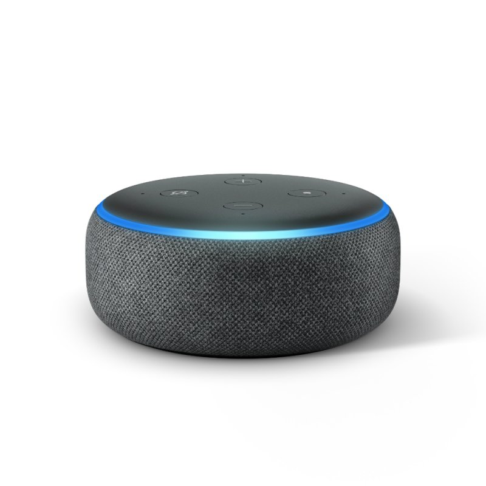

<h1 align="center">
  
   
  Smart Home
</h1>
<h4 align="center">Marque :star: no meu repositório de configuração para que você possa se manter atualizado sobre qualquer progresso diário!</h4>

  <h4>
    
    
    
    
  </h4>

## Dispositivos

<table align="center" border="0">
<tr>
  <th>Imagem</th>
  <th>Nome</th>
  <th>Descrição</th>
  <th>Quantidade</th>
  <th>Conexão</th>
</tr>
  <tr>
    <td>
      
      
(5) - 

    </td>
    <td>Amazon Echo Dot 3</td>
    <td>Notificação sonoras, comando por voz, musica</td>
    <td>5</td>
    <td>Wifi</td>
  </tr>
